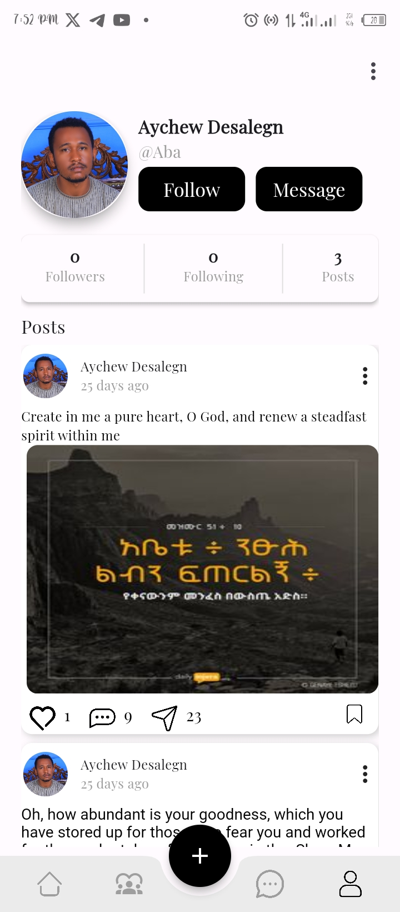
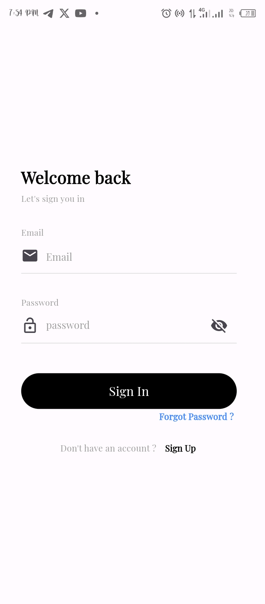
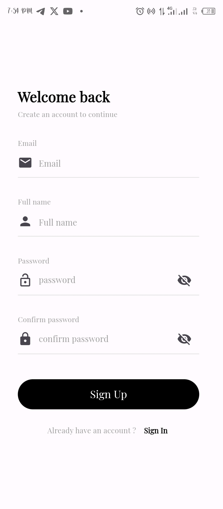

# Grace-Link Christian Community App


## Table of Contents
- [About the Project](#about-the-project)
  - [Features](#features)
  - [Built With](#built-with)
- [Getting Started](#getting-started)
  - [Prerequisites](#prerequisites)
  - [Installation](#installation)
- [Usage](#usage)
- [Screenshots](#screenshots).
- [Roadmap](#roadmap)
- [Contributing](#contributing)
- [License](#license)
- [Contact](#contact)
- [Acknowledgements](#acknowledgements)

## About the Project

[](link-to-screenshot.png)

The Grace-Link Christian Community app is designed to foster community, communication, and spiritual growth among members of the Christian faith. Our mission is to provide a safe and welcoming space for Christians to connect, share, and support each other in their faith journey.

### Features
- **Community Feed**: Share updates, photos, and prayer requests with your community.
- **Groups and Events**: Join groups and events to engage with like-minded individuals.
- **Messaging**: Private messaging to stay connected with friends and community members.
- **Bible Study Tools**: Access Bible study materials and daily devotionals.
- **Prayer Wall**: Post prayer requests and pray for others.

### Built With
- [Flutter](https://flutter.dev/) - Cross-platform mobile framework
- [Firebase](https://firebase.google.com/) - Backend services including authentication and real-time database
- [Google Cloud Platform](https://cloud.google.com/) - Cloud hosting and storage
- [Dart](https://dart.dev/) - Programming language

## Getting Started

To get a local copy up and running follow these simple steps.

### Prerequisites

Ensure you have the following installed:
- Flutter SDK: [Installation Guide](https://flutter.dev/docs/get-started/install)
- Dart: Included with Flutter SDK
- Firebase CLI: [Installation Guide](https://firebase.google.com/docs/cli)

### Installation

1. Clone the repo
```sh
git clone https://github.com/yourusername/grace-link.git

2. Navigate to the project directory
```sh
cd grace-link
```
3. Install Flutter packages
```sh
flutter pub get
```
4. Set up Firebase for the project (iOS and Android)
   - Follow the instructions in the [Firebase documentation](https://firebase.google.com/docs/flutter/setup).

5. Run the app
```sh
flutter run
```

## Usage

Once the app is up and running, you can explore its features:
- **Sign Up/Login**: Create a new account or log in with existing credentials.
- **Explore Feed**: See posts from your community.
- **Join Groups**: Participate in groups and events that interest you.
- **Send Messages**: Communicate with other users through private messaging.
- **Prayer Wall**: Share and respond to prayer requests.

## Screenshots
<p align = "center">


</p>









## Roadmap

We are continuously working to improve the app and add new features. Here's what's coming next:
- [ ] Video Sermons and Live Streaming
- [ ] Enhanced Group Management Tools
- [ ] More Bible Study Resources
- [ ] User Profile Customization
- [ ] Push Notifications for Important Updates

See the [open issues](https://github.com/yourusername/grace-link/issues) for a full list of proposed features and known issues.

## Contributing

We welcome contributions to enhance the app! Here's how you can get involved:
1. Fork the Project
2. Create your Feature Branch (`git checkout -b feature/AmazingFeature`)
3. Commit your Changes (`git commit -m 'Add some AmazingFeature'`)
4. Push to the Branch (`git push origin feature/AmazingFeature`)
5. Open a Pull Request

## License

Distributed under the MIT License. See `LICENSE.txt` for more information.

## Contact

Your Name - [@your_twitter_handle](https://twitter.com/your_twitter_handle) - your.email@example.com

Project Link: [https://github.com/yourusername/grace-link](https://github.com/yourusername/grace-link)

## Acknowledgements

- [Flutter](https://flutter.dev/)
- [Firebase](https://firebase.google.com/)
- [Google Cloud Platform](https://cloud.google.com/)
- [Christian Community Inspiration](https://example.com)
- [Open Source Contributors](https://github.com/yourusername/grace-link/graphs/contributors)
```
